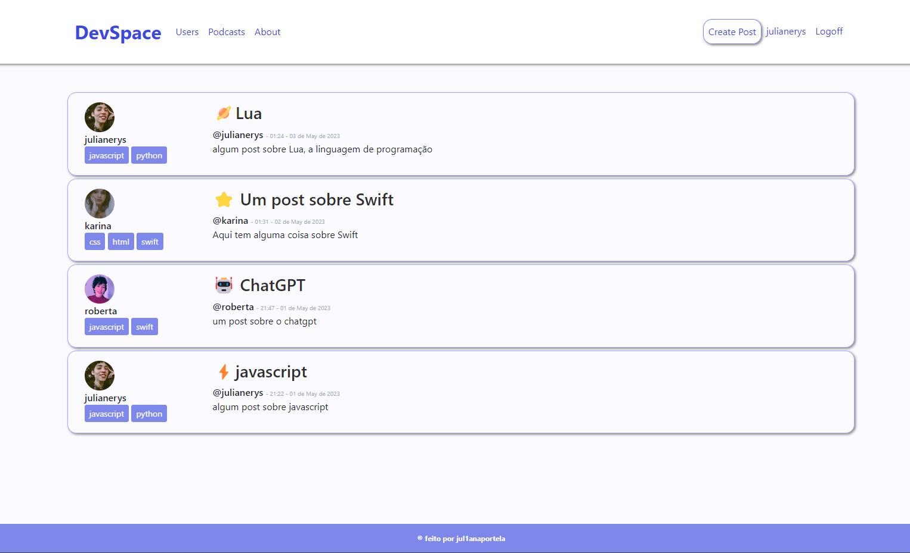
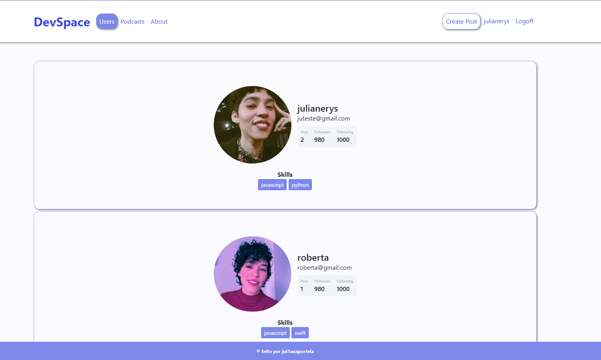
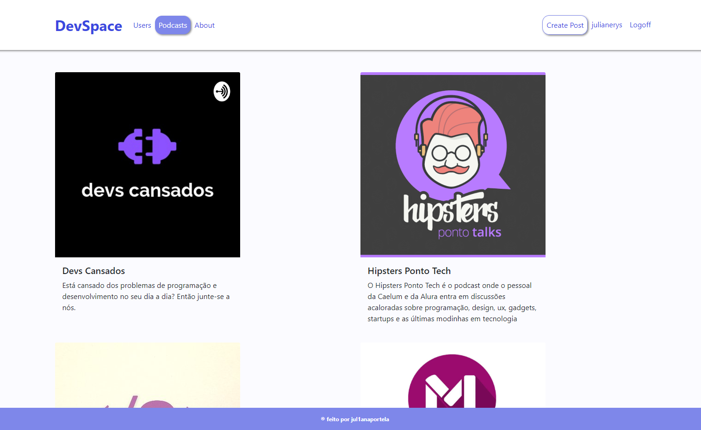
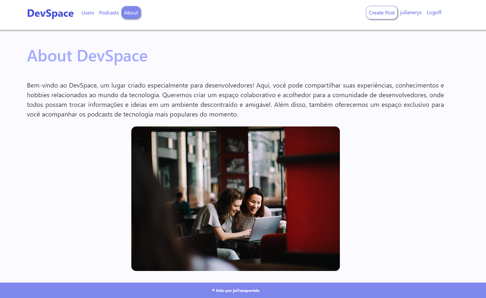

<h1 align="center"> DevSpace </h1>

🚧 Meu primeiro projeto utilizando a tecnologia Flask 🚧

  <a href="#-tecnologias">Tecnologias</a>&nbsp;&nbsp;&nbsp;|&nbsp;&nbsp;&nbsp;
  <a href="#-projeto">Projeto</a>&nbsp;&nbsp;&nbsp;|&nbsp;&nbsp;&nbsp;
  <a href="#-layout">Layout</a>&nbsp;&nbsp;&nbsp;|&nbsp;&nbsp;&nbsp;
  <a href="#-desafios">Desafios</a>&nbsp;&nbsp;&nbsp;|&nbsp;&nbsp;&nbsp;

## Home
 

  

 

## 🚀 Tecnologias

Esse projeto foi desenvolvido com as seguintes tecnologias:

- HTML 
- CSS
- Bootstrap
- Flask
- Python
- Git/Github

## 💻 Projeto

DevSpace é um lugar criado especialmente para desenvolvedores! Aqui, você pode compartilhar suas experiências, conhecimentos e hobbies relacionados ao mundo da tecnologia. Queremos criar um espaço colaborativo e acolhedor para a comunidade de desenvolvedores, onde todos possam trocar informações e ideias em um ambiente descontraído e amigável. Além disso, também oferecemos um espaço exclusivo para você acompanhar os podcasts de tecnologia mais populares do momento.

Acreditamos que a tecnologia é uma ferramenta poderosa para criar soluções inovadoras e mudar o mundo. E, por isso, queremos incentivar o compartilhamento de conhecimentos e a colaboração entre os desenvolvedores.

Venha fazer parte da nossa comunidade e compartilhar suas ideias e experiências conosco. Juntos, podemos construir um espaço incrível para os desenvolvedores!

## 🔖 Layout
 

### Users
 

  

### Podcasts
 

  

### About
 

  

## 🔖 Desafios

texto
texto
texto
texto
texot
esdt

